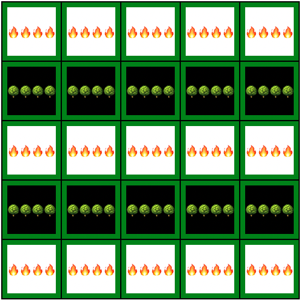

<a href="https://whilekofman.github.io/extinguish/">Play extinguish!</a>
Extinguish
Functionality & MVPs

Extinguish is a game that is based on the hand held electronic game Lightsout. The game will work as follows:

* The base game will begin on a 5 * 5 grid.
* Each posiion on the grid will store a value: "on/off" 
* The user can choose to have the board generate a starting state or the user can select which positions to toggle on before starting the game.
* Once the user selects to start a game, the goal is to have all positions on the board to be set to off. 
* A positions state is toggled when the user selects that position. 
* When a positions state is toggled it also impacts the state of all of the adjacent postions, toggling their values.


This project includes:
* Webpack 
* Babel 
* NPM 

Future updates will include:
* Seemless level resets 
* More levels 
* Random levels 
* Solution hints 
* Ability to create custom levels
* Store scores
* Tile animations

Potential bonus functionality:
* Secret bonus level
* Preset start states that the user can select from visually
* Allowing the user to select a larger game grid
* Adding additional states to each position.


Currently grid generation is handled by passing in an array of 5 numbers from 0 - 31 inclusive. This range represents all possible arrangements for 2 values to be stored an object of length 5. 
Using bitwise opperations each row of the grid can be set, or stored as a single integer, and then represented on the grid as their binary values.  A 0 here would represent an unlit square and a 1 would be a lit square.    
By doing it this way we can store boards without the need to hardcode their x, y coordinates for each space, and future boards can be generated by picking a number in range (0, 31) for each row.  This will also allow for future implementations with different grid sizes as the number of possible combination is based on 2 to the nth power where n represents the length of the rows.


```javascript   
numsToGrid(arr) {
    const grid = []
    arr.forEach(num => {
        const row = []
        let i = 0
        let numCopy = num
        while (i < 5) {
            row.unshift(numCopy & 1)
            numCopy = numCopy >> 1
            i ++
        }
        grid.push(row)
    })
    return(grid)
}

const topRightCorner = [3, 1, 0, 0, 0]
const topLeftCorner = [24, 16, 0, 0, 0]
const original =[31, 0, 31, 0, 31]


```

As an example the level below can be stored in an array of length 5 consisting of [31, 0, 31, 0, 31]



